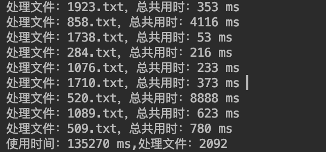
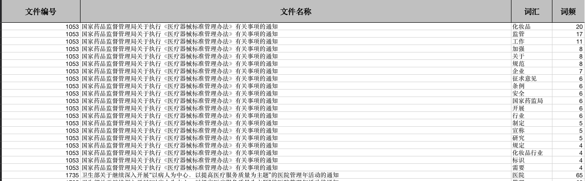

# word-segment

一个基于`HanLP`的分词工具。

## 特性

1. NLP分词
2. 词频统计与过滤
3. 批量文件导入
4. 导出Excel

## 使用

1. 下载：[data.zip](http://nlp.hankcs.com/download.php?file=data)

```shell
.
├── LICENSE
├── README.md
├── data			#放入
├── docs
├── out.xlsx
├── pom.xml
├── src
├── summary.xlsx
├── target
└── word-segment.iml
```

2. 对`src/main/resources/hanlp.propertieshanlp.properties`文件进行修改，通过`pwd`获取，替换root

```properties
#本配置文件中的路径的根目录，根目录+其他路径=完整路径（支持相对路径，请参考：https://github.com/hankcs/HanLP/pull/254）
#Windows用户请注意，路径分隔符统一使用/
root=/Users/mac/project/PersonalRepository/word-segment
```

3. `IDEA`打开直接运行`App.java`

##  示例





## 参考

1. [Hanlp](https://github.com/hankcs/HanLP/blob/master/README.md)
2. [EasyExcel](https://github.com/alibaba/easyexcel)